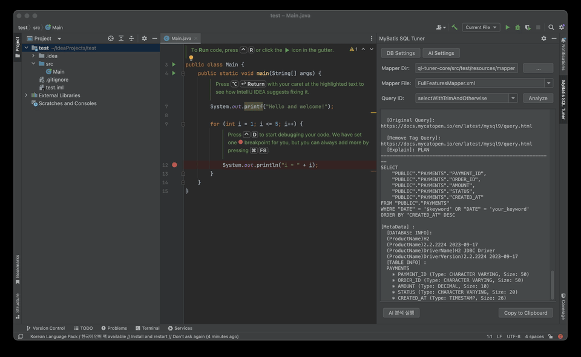

# 🚀 mybatis-sql-tuner-ai

<p align="center">
  
  
  
  
  
  
  
</p>

> **AI-Assisted MyBatis SQL Tuning & Static Analysis Tool for IntelliJ IDEA**
> A developer productivity tool that automatically converts dynamic MyBatis XML mapper queries into
> executable SQL (`fakeSql`), collects the DB execution plan (`EXPLAIN`) and metadata, and streams a
> **senior-DBA-persona AI tuning report in real time**.

<p align="center">
  
</p>

---

## 📌 1. Key Features

* 🪄 **Automatic MyBatis dynamic tag stripping & fakeSql conversion**: Parses `<where>`, `<if>`, `<choose>`, `<foreach>`, `<trim>`, `<set>`, `<bind>`, and `<include>` tags and auto-generates a virtual SQL statement that your DB can `EXPLAIN` immediately.
* 📊 **Real-time DB EXPLAIN & metadata collection**: Extracts target-table DDL, column types/sizes, index information, and the transaction isolation level (`TRANSACTION ISOLATION`) with one click.
* 🤖 **Real-time AI streaming analysis (OpenAI / Ollama compatible)**: Composes a senior-DBA-persona optimization prompt and streams a tuning report token by token from a local LLM (Ollama) or a cloud LLM (OpenAI, etc.).
* 🔒 **Per-project independent settings**: DB and AI connection settings are kept per IntelliJ project — non-secret values via `PropertiesComponent`, and the DB password / AI API key via the OS credential store (`PasswordSafe`) — so there's no separate config file to manage.

---

## 🌐 2. Compatibility

### 🗄 Supported Databases
* **MySQL** (5.7 / 8.0+)
* **MariaDB** (10.x / 11.x+)
* **PostgreSQL** (12+)
* **H2 Database** (In-Memory / Test)

### 🧠 Supported AI Providers
* **Local LLM**: [Ollama](https://ollama.com/) (`qwen2.5-coder`, `llama3`, `deepseek-coder`, etc.)
* **Cloud LLM**: OpenAI (`gpt-4o`, `gpt-4o-mini`), OpenRouter, vLLM, and **any model compatible with the OpenAI chat-completions spec (`POST /v1/chat/completions`)**

---

## 🛡 3. Code Quality & Automation Pipeline

This project runs a strict automation pipeline to keep code quality and reliability high.

| Tool | Role | Verification |
| :--- | :--- | :--- |
| **Spotless** | Enforces a unified code style via the Eclipse formatter | `./gradlew spotlessCheck` |
| **SpotBugs** | Static analysis for potential bugs/anti-patterns at the Java bytecode level | `./gradlew spotbugsMain` |
| **JaCoCo** | Enforces **100% line coverage** on the core parser module | `./gradlew jacocoTestCoverageVerification` |
| **CodeRabbit AI** | Automatic AI code review of the diff on every PR | Auto-linked via GitHub PR webhook |
| **GitHub Actions** | Automatic build, test, and Step Summary report on push/PR | `.github/workflows/ci.yml` |

---

## 💻 4. How to Run & Develop

You can run a local IntelliJ IDEA sandbox with the plugin installed to try the feature immediately.

```bash
# Launch the sandbox IntelliJ IDEA instance
./gradlew :mybatis-sql-tuner-intellij:runIde
```
> In the sandbox IDE, open a MyBatis mapper XML file and try the feature right away via the right-click menu (`Tune SQL with AI`) or the tool window on the right (`MyBatis SQL Tuner`).

---

## 🔨 5. Build & Test

### 1) Full verification: unit tests, Spotless, SpotBugs, 100% coverage
```bash
# Run all unit tests and every quality gate
./gradlew check
```

### 2) Auto-format code (Spotless Apply)
```bash
# Auto-format using the Eclipse formatter style
./gradlew spotlessApply
```

### 3) Build the distributable plugin zip
```bash
# Produce the distributable plugin zip
./gradlew :mybatis-sql-tuner-intellij:buildPlugin
```
* **Output artifact**: `mybatis-sql-tuner-intellij/build/distributions/mybatis-sql-tuner-intellij-0.1.1.zip`

---

## 📦 6. Installation

### Option A: Install from the JetBrains Marketplace
1. Open IntelliJ IDEA, go to `Settings` (`Ctrl+Alt+S` or `Cmd+,`) → **Plugins**
2. Search for `MyBatis SQL Tuner AI` in the **Marketplace** tab (or visit the [Marketplace listing](https://plugins.jetbrains.com/plugin/34051-mybatis-sql-tuner-ai))
3. Click **Install**, then restart the IDE

### Option B: Manual install from a zip file (local build)
1. Open IntelliJ IDEA, go to `Settings` → **Plugins**
2. Click the gear icon (⚙️) at the top → **Install Plugin from Disk...**
3. Select the built `mybatis-sql-tuner-intellij-0.1.1.zip` file
4. Restart the IDE and confirm the **MyBatis SQL Tuner** tool window on the right sidebar

---

## 📚 7. Development & Contribution Docs

* 🏗 **[Architecture Guide (docs/ARCHITECTURE.md)](docs/ARCHITECTURE.md)**: XML parsing, AST stripping, fakeSql generation, SSE streaming flow
* 📐 **[Coding & Commit Conventions (docs/CONVENTIONS.md)](docs/CONVENTIONS.md)**: Java code style, unit-testing principles, Conventional Commits rules
* 🤝 **[Contributing Guide (CONTRIBUTING.md)](CONTRIBUTING.md)**: Dev environment setup, branch strategy, PR submission guide
* 📘 **[Open Source Migration Playbook (docs/OPEN_SOURCE_MIGRATION_PLAYBOOK.md)](docs/OPEN_SOURCE_MIGRATION_PLAYBOOK.md)**: Shared migration & quality-gate setup procedure for sweetpark org projects
* 📜 **[Code of Conduct (CODE_OF_CONDUCT.md)](CODE_OF_CONDUCT.md)**: Contributor Covenant 2.1
* ⚖️ **[License (LICENSE)](LICENSE)**: Apache License 2.0
