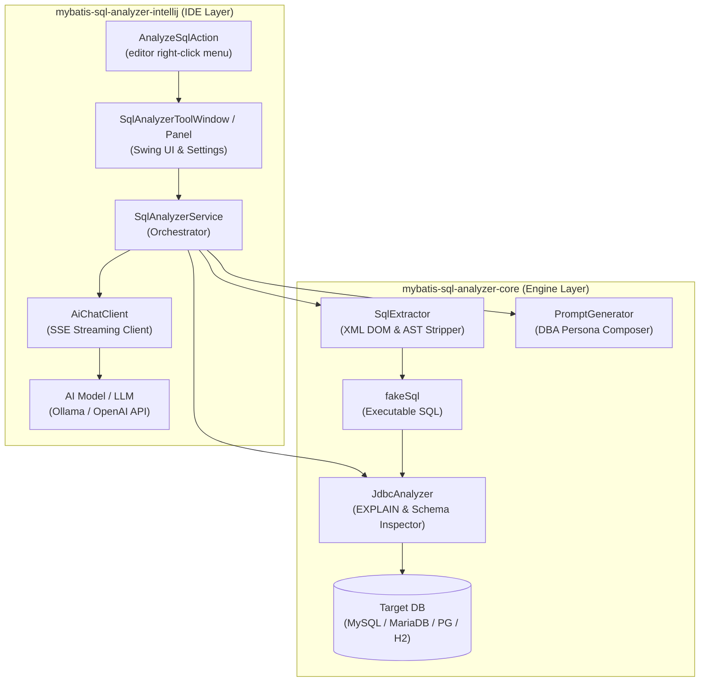
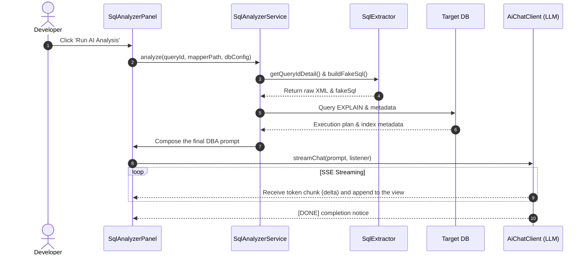

# 🏗 MyBatis SQL Tuner AI Architecture Guide

This document explains the system structure, inter-module interaction, and data flow of the
`mybatis-sql-tuner-ai` project.

---

## 1. Overall System Architecture

---

## 2. Module Responsibilities & Design Principles

### 1) `mybatis-sql-analyzer-core` (standalone static-analysis & parser engine)
A pure Java library (Java 17+) with no IDE dependency, so it can be reused from a CLI or a CI/CD pipeline.

* **`SqlExtractor`**:
  - Reads a MyBatis XML file with a DOM parser and extracts the node for a given `queryId`.
  - Recursively resolves and inlines `<include refid="...">` tags.
  - Strips dynamic tags such as `<where>`, `<if>`, `<choose>`, `<when>`, `<otherwise>`, `<set>`, `<trim>`, `<bind>` and flattens the conditional branches into a single executable `fakeSql`.
* **`JdbcAnalyzer`**:
  - Substitutes bind variables (`#{...}`, `${...}`) in `fakeSql` with dummy literals so `EXPLAIN` can run against the real DB without a syntax error.
  - Extracts the referenced table list via JSqlParser, and collects table DDL, column types, index information, and the transaction isolation level via JDBC `DatabaseMetaData`.
* **`PromptGenerator`**:
  - Combines the collected raw XML query, `fakeSql`, `EXPLAIN` execution plan, and table/index metadata into an optimization prompt written from the perspective of a **senior DBA persona with 10 years of experience**.

### 2) `mybatis-sql-analyzer-intellij` (IDE plugin layer)
The UI and asynchronous streaming integration module that runs on the IntelliJ IDEA platform.

* **`AnalyzeSqlAction`**:
  - Invoked from a right-click in the mapper XML editor; pre-validates the XML on a background thread (`ActionUpdateThread.BGT`).
* **`SqlAnalyzerPanel` / `SqlAnalyzerToolWindow`**:
  - Docked as a tool window on the right of the editor; provides mapper-directory browsing, file filtering, and `queryId` selection UI.
  - DB connection info and the AI endpoint settings are kept safely per IntelliJ project — non-secret values via `PropertiesComponent`, and the DB password / AI API key via the OS credential store (`PasswordSafe`).
* **`AiChatClient`**:
  - Uses the Java 11 standard `HttpClient` with `BodyHandlers.ofLines()` to parse Server-Sent Events (SSE) chunks (`data: {...}`) from `POST /v1/chat/completions` token by token in real time, and dispatches them to the EDT.

---

## 3. Execution & Data Analysis Pipeline

