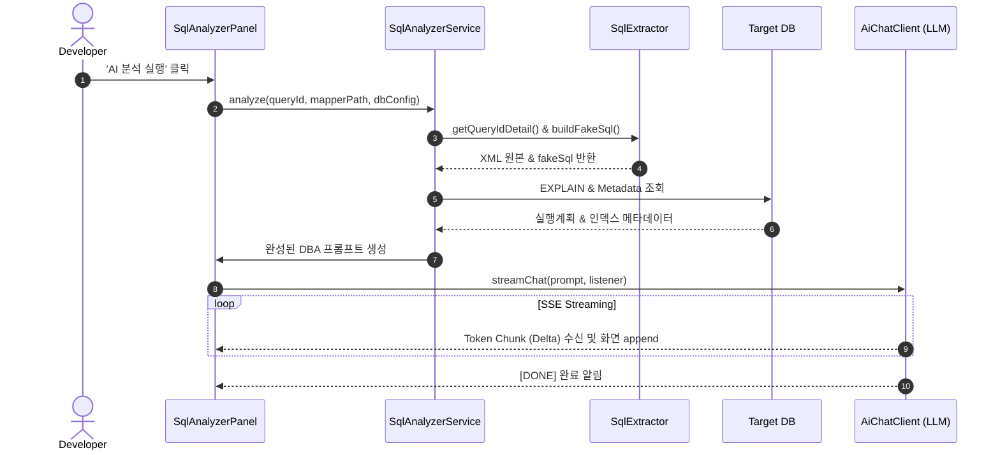

# 🏗 MyBatis SQL Tuner AI 아키텍처 가이드

이 문서는 `mybatis-sql-tuner-ai` 프로젝트의 시스템 구조, 모듈 간 상호작용 및 데이터 흐름을 설명합니다.

---

## 1. 전체 시스템 아키텍처

---

## 2. 모듈별 역할 및 설계 원칙

### 1) `mybatis-sql-analyzer-core` (독립 정적 분석 및 파서 엔진)
IDE에 의존하지 않는 순수 Java 라이브러리(Java 17+)로, CLI나 CI/CD 파이프라인에서도 재사용할 수 있는 핵심 모듈입니다.

* **`SqlExtractor`**:
  - MyBatis XML 파일을 DOM 파서로 읽어 지정된 `queryId`의 노드를 추출합니다.
  - `<include refid="...">` 태그를 재귀적으로 해석하고 치환합니다.
  - `<where>`, `<if>`, `<choose>`, `<when>`, `<otherwise>`, `<set>`, `<trim>`, `<bind>` 등 동적 태그를 제거하고 조건절을 단일 실행 가능한 `fakeSql`로 평탄화(Flattening)합니다.
* **`JdbcAnalyzer`**:
  - `fakeSql` 내의 바인드 변수(`#{...}`, `${...}`)를 임의의 더미 리터럴로 치환하여 실제 DB에서 문법 에러 없이 `EXPLAIN`을 수행합니다.
  - JSqlParser를 통해 참조 테이블 목록을 추출하고, JDBC `DatabaseMetaData`를 통해 테이블 DDL, 컬럼 타입, 인덱스 정보 및 트랜잭션 격리수준을 수집합니다.
* **`PromptGenerator`**:
  - 수집된 원본 XML 쿼리, `fakeSql`, `EXPLAIN` 실행계획, 테이블/인덱스 메타데이터를 **10년 차 수석 DBA 페르소나** 기반 최적화 프롬프트로 조합합니다.

### 2) `mybatis-sql-analyzer-intellij` (IDE 플러그인 레이어)
IntelliJ IDEA 플랫폼 위에서 동작하는 UI 및 비동기 스트리밍 연동 모듈입니다.

* **`AnalyzeSqlAction`**:
  - 매퍼 XML 에디터에서 우클릭 시 호출되며, 백그라운드 스레드(`ActionUpdateThread.BGT`)에서 XML 유효성을 사전 검증합니다.
* **`SqlAnalyzerPanel` / `SqlAnalyzerToolWindow`**:
  - 에디터 우측 툴윈도우에 고정되며, 매퍼 디렉토리 탐색, 파일 필터링, `queryId` 선택 UI를 제공합니다.
  - DB 접속 정보 및 AI 엔드포인트 설정은 IntelliJ의 `PropertiesComponent`를 통해 프로젝트 단위로 안전하게 유지됩니다.
* **`AiChatClient`**:
  - Java 11 표준 `HttpClient`와 `BodyHandlers.ofLines()`를 활용하여 `POST /v1/chat/completions`의 Server-Sent Events (SSE) 청크(`data: {...}`)를 토큰 단위로 실시간 파싱하고 EDT 스레드로 전달합니다.

---

## 3. 실행 및 데이터 분석 파이프라인

