# 🚀 JetBrains Marketplace Registration & Automated Publishing Guide

This document walks through registering the `MyBatis SQL Analyzer` IntelliJ plugin on the official
**JetBrains Marketplace** and setting up an automated publishing pipeline.

---

## 📌 Overall Publishing Flow

```mermaid
flowchart TD
    A["1. Register a JetBrains account & Vendor"] --> B["2. Issue a Marketplace Hub Token"]
    B --> C["3. Generate a plugin signing certificate"]
    C --> D["4. Configure GitHub Secrets or local env vars"]
    D --> E["5. Run Gradle publishPlugin (locally or via GitHub Actions)"]
    E --> F["6. Marketplace review & approval (1-2 business days)"]
    F --> G["🎉 Searchable & one-click installable on the Marketplace"]
```



---

## 🛠 Step 1: Register a JetBrains Marketplace Account & Vendor

1. Go to the [JetBrains Marketplace](https://plugins.jetbrains.com/) and sign in with your JetBrains account.
2. Click the profile icon in the top right → select **Vendors**.
3. Click **Create Vendor** and register your vendor information.
   - **Vendor Name**: `sweetpark` (or your preferred official developer/organization name)
   - **Email / Website**: A public-facing email address and your GitHub repository URL

---

## 🔑 Step 2: Issue a Marketplace API Token (Hub Token)

Generate an API token that Gradle or your CI pipeline can use to automatically upload the plugin.

1. Go to [JetBrains Marketplace Hub Tokens](https://plugins.jetbrains.com/author/me/tokens).
2. Click **Generate New Token**.
3. Configure the token:
   - **Name**: `mybatis-sql-tuner-ai-publisher`
   - **Permissions**: `Permit plugin upload`
4. Copy the generated token string and store it securely.

---

## 🔐 Step 3: Generate a Plugin Signing Key

The JetBrains Marketplace recommends signing your plugin to guarantee its integrity and authenticity.

Use `openssl` to generate a private key (`private.pem`) and a certificate chain (`cert.pem`):

```bash
# Generate a certificate and private key (10-year validity)
openssl req -x509 -newkey rsa:4096 -keyout private.pem -out cert.pem -days 3650 -nodes -subj "/CN=sweetpark"
```

---

## ⚙️ Step 4: Configure Environment Variables (Local & GitHub Actions)

### 1) Set environment variables in a local terminal (PowerShell)
```powershell
$env:JETBRAINS_MARKETPLACE_TOKEN="perm:xxxxxxxxxxxxxx"
$env:CERTIFICATE_CHAIN=[System.IO.File]::ReadAllText("cert.pem")
$env:PRIVATE_KEY=[System.IO.File]::ReadAllText("private.pem")
$env:PRIVATE_KEY_PASSWORD="" # leave blank if you did not set a password
```

### 2) Configure GitHub Actions Secrets (for automated CI/CD publishing)
In your repository, go to `Settings` → `Secrets and variables` → `Actions` and register the following secrets:
- `JETBRAINS_MARKETPLACE_TOKEN`
- `CERTIFICATE_CHAIN`
- `PRIVATE_KEY`
- `PRIVATE_KEY_PASSWORD`

---

## 🤖 Step 5: Set Up the GitHub Actions Auto-Publish Pipeline

Adding `.github/workflows/release-plugin.yml` to the repository automatically builds, signs, and
uploads the plugin to the Marketplace whenever a new release tag (e.g., `v0.1.0`) is pushed.

```yaml
name: Release Plugin to JetBrains Marketplace

on:
  push:
    tags:
      - 'v*'

jobs:
  publish:
    runs-on: ubuntu-latest
    steps:
      - name: Checkout Code
        uses: actions/checkout@v4

      - name: Setup Java 17
        uses: actions/setup-java@v4
        with:
          distribution: 'temurin'
          java-version: '17'

      - name: Setup Gradle
        uses: gradle/actions/setup-gradle@v3

      - name: Verify and Test
        run: ./gradlew check

      - name: Publish Plugin to Marketplace
        env:
          JETBRAINS_MARKETPLACE_TOKEN: ${{ secrets.JETBRAINS_MARKETPLACE_TOKEN }}
          CERTIFICATE_CHAIN: ${{ secrets.CERTIFICATE_CHAIN }}
          PRIVATE_KEY: ${{ secrets.PRIVATE_KEY }}
          PRIVATE_KEY_PASSWORD: ${{ secrets.PRIVATE_KEY_PASSWORD }}
        run: ./gradlew :mybatis-sql-analyzer-intellij:publishPlugin
```

---

## 💻 Step 6: Publish Manually via Gradle

To upload directly to the Marketplace from your local machine, run:

```bash
./gradlew :mybatis-sql-analyzer-intellij:publishPlugin
```

---

## ⏱ Step 7: JetBrains Review & Marketplace Launch

1. **First upload (new registration)**:
   - When a plugin is first uploaded to the Marketplace, it enters a Pending Approval state.
   - JetBrains' security team reviews the code, license, and description formatting; this typically takes **1-2 business days**.
2. **Version updates**:
   - After initial approval, subsequent version updates go live within minutes to a few hours once they pass automated verification (Plugin Verifier).
3. **User installation**:
   - Once approved, developers worldwide can find and install **"MyBatis SQL Analyzer"** with a single click from `Settings > Plugins > Marketplace` in IntelliJ IDEA.
