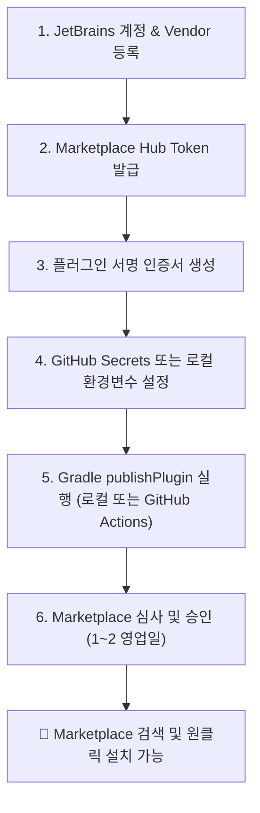

# 🚀 JetBrains Marketplace 등록 및 자동 배포 가이드

이 문서는 `MyBatis SQL Analyzer` IntelliJ 플러그인을 공식 **JetBrains Marketplace**에 등록하고 자동 배포 파이프라인을 구축하는 절차를 안내합니다.

---

## 📌 전체 배포 흐름



---

## 🛠 1단계: JetBrains Marketplace 계정 및 Vendor 등록

1. [JetBrains Marketplace](https://plugins.jetbrains.com/)에 접속하여 JetBrains 계정으로 로그인합니다.
2. 우측 상단 프로필 아이콘 클릭 → **Vendors** 선택
3. **Create Vendor** 버튼을 클릭하여 Vendor 정보를 등록합니다.
   - **Vendor Name**: `sweetpark` (또는 원하는 공식 개발자/조직명)
   - **Email / Website**: 공개용 이메일 및 GitHub 저장소 주소 입력

---

## 🔑 2단계: Marketplace API Token (Hub Token) 발급

Gradle 빌드 스크립트 또는 CI 파이프라인에서 플러그인을 자동으로 업로드하기 위한 API 토큰을 생성합니다.

1. [JetBrains Marketplace Hub Tokens](https://plugins.jetbrains.com/author/me/tokens) 페이지로 이동합니다.
2. **Generate New Token** 클릭
3. 토큰 설정:
   - **Name**: `mybatis-sql-tuner-ai-publisher`
   - **Permissions**: `Permit plugin upload`
4. 생성된 토큰 문자열을 안전하게 복사하여 보관합니다.

---

## 🔐 3단계: 플러그인 서명 키 (Plugin Signing) 생성

JetBrains Marketplace는 플러그인의 무결성과 신뢰성을 보장하기 위해 서명(Plugin Signing)을 권장합니다.

`openssl` 명령어를 사용하여 개인키(`private.pem`)와 인증서 체인(`cert.pem`)을 생성합니다:

```bash
# 인증서 및 개인키 생성 (유효기간 10년)
openssl req -x509 -newkey rsa:4096 -keyout private.pem -out cert.pem -days 3650 -nodes -subj "/CN=sweetpark"
```

---

## ⚙️ 4단계: 환경 변수 설정 (Local & GitHub Actions)

### 1) 로컬 터미널에서 환경변수 설정 (PowerShell)
```powershell
$env:JETBRAINS_MARKETPLACE_TOKEN="perm:xxxxxxxxxxxxxx"
$env:CERTIFICATE_CHAIN=[System.IO.File]::ReadAllText("cert.pem")
$env:PRIVATE_KEY=[System.IO.File]::ReadAllText("private.pem")
$env:PRIVATE_KEY_PASSWORD="" # 비밀번호 미설정 시 공백
```

### 2) GitHub Actions Secrets 설정 (CI/CD 자동 배포 시)
GitHub 저장소의 `Settings` → `Secrets and variables` → `Actions`에 아래 시크릿을 등록합니다:
- `JETBRAINS_MARKETPLACE_TOKEN`
- `CERTIFICATE_CHAIN`
- `PRIVATE_KEY`
- `PRIVATE_KEY_PASSWORD`

---

## 🤖 5단계: GitHub Actions 자동 배포 파이프라인 구축

저장소에 `.github/workflows/release-plugin.yml` 파일을 추가하면, 새로운 Release 태그(예: `v0.1.0`) 푸시 시 자동으로 빌드, 서명, Marketplace 업로드가 수행됩니다.

```yaml
name: Release Plugin to JetBrains Marketplace

on:
  push:
    tags:
      - 'v*'

jobs:
  publish:
    runs-on: ubuntu-latest
    steps:
      - name: Checkout Code
        uses: actions/checkout@v4

      - name: Setup Java 17
        uses: actions/setup-java@v4
        with:
          distribution: 'temurin'
          java-version: '17'

      - name: Setup Gradle
        uses: gradle/actions/setup-gradle@v3

      - name: Verify and Test
        run: ./gradlew check

      - name: Publish Plugin to Marketplace
        env:
          JETBRAINS_MARKETPLACE_TOKEN: ${{ secrets.JETBRAINS_MARKETPLACE_TOKEN }}
          CERTIFICATE_CHAIN: ${{ secrets.CERTIFICATE_CHAIN }}
          PRIVATE_KEY: ${{ secrets.PRIVATE_KEY }}
          PRIVATE_KEY_PASSWORD: ${{ secrets.PRIVATE_KEY_PASSWORD }}
        run: ./gradlew :mybatis-sql-analyzer-intellij:publishPlugin
```

---

## 💻 6단계: Gradle을 통한 수동 배포 명령어

로컬에서 직접 Marketplace로 업로드할 때는 아래 명령어를 실행합니다:

```bash
./gradlew :mybatis-sql-analyzer-intellij:publishPlugin
```

---

## ⏱ 7단계: JetBrains 심사 및 마켓 오픈

1. **최초 업로드(신규 등록)**:
   - 플러그인이 처음 Marketplace에 업로드되면 JetBrains 승인 대기(Pending Approval) 상태가 됩니다.
   - JetBrains 보안팀에서 코드 및 라이선스, description 규격 등을 심사하며 보통 **1~2 영업일**이 소요됩니다.
2. **버전 업데이트(Update)**:
   - 승인 이후의 버전 업데이트는 자동 검증(Plugin Verifier) 통과 시 수 분~수 시간 내에 즉시 배포됩니다.
3. **사용자 설치**:
   - 승인 완료 후 전 세계 개발자가 IntelliJ IDEA의 `Settings > Plugins > Marketplace`에서 **"MyBatis SQL Analyzer"** 를 검색하여 클릭 한 번으로 설치할 수 있게 됩니다.
