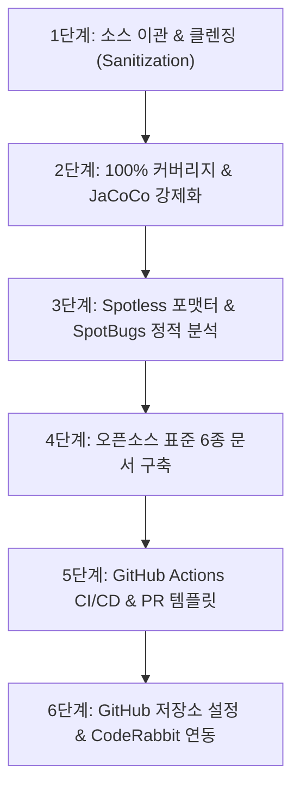

# 📘 오픈소스 이관 및 표준화 플레이북 (Open Source Migration Playbook)

> **대상 프로젝트**: `mybatis-sql-tuner-ai`, `mini-apm-spring-boot-starter`, `ha-excel-job-engine` 등 `sweetpark` 조직 내 모든 오픈소스 저장소  
> **목적**: 사내/기존 저장소의 소스코드를 안전하게 이관하고, 최상위 품질 게이트(100% 커버리지, Spotless, SpotBugs, CI, CodeRabbit)와 표준 문서를 갖춘 공개 오픈소스로 표준화하기 위한 표준 절차서입니다.

---

## 📋 표준 이관 체크리스트 (6단계 프로세스)



---

## 🛠 1단계: 소스코드 이관 및 클렌징 (Sanitization)

1. **패키지 경로 일원화**:
   - 사내 패키지(`com.company.*` 등)를 공식 오픈소스 패키지명으로 변경:
     - 예: `io.github.sweetpark.miniapm`, `io.github.sweetpark.haexcel`
2. **기밀 및 사내 전용 정보 완전 제거**:
   - 사내 고정 IP(예: `13.124.xxx.xxx`), 사내 전용 URL/도메인, 테스트용 내부 계정 정보 검색(`grep`) 및 제거
   - 설정값은 `application.yml`의 기본값(`localhost`)과 Spring `@ConfigurationProperties` 또는 환경변수로 오버라이드 가능하도록 구조화
3. **Lombok 의존성 최소화 / SLF4J 로거 표준화**:
   - JDK 17~25+ 전 버전 호환성을 위해 로거를 `LoggerFactory.getLogger(ClassName.class)`로 표준화

---

## 🧪 2단계: 단위 테스트 및 100% 라인 커버리지 강제화

1. **JaCoCo 플러그인 설정 (`build.gradle`)**:
   ```groovy
   plugins {
       id 'jacoco'
   }

   jacoco {
       toolVersion = "0.8.12"
   }

   jacocoTestCoverageVerification {
       dependsOn test
       violationRules {
           rule {
               element = 'CLASS'
               limit {
                   counter = 'LINE'
                   value = 'COVEREDRATIO'
                   minimum = 1.00 // 100% 라인 커버리지 강제
               }
           }
       }
   }
   check.dependsOn jacocoTestCoverageVerification
   ```
2. **Native Dynamic Proxy 기반 테스트 작성**:
   - 바이트코드 조작 기반 Mock 라이브러리가 최신 JDK에서 깨지는 현상을 방지하기 위해 Java 표준 `Proxy.newProxyInstance(...)`로 인터페이스 Mocking.

---

## 🎨 3단계: Spotless 코드 포맷터 & SpotBugs 정적 분석

1. **Root `build.gradle` 설정**:
   ```groovy
   plugins {
       id 'com.diffplug.spotless' version '6.25.0' apply false
       id 'com.github.spotbugs' version '6.0.26' apply false
   }

   subprojects {
       apply plugin: 'com.diffplug.spotless'
       apply plugin: 'com.github.spotbugs'

       spotless {
           java {
               eclipse()
               trimTrailingWhitespace()
               endWithNewline()
           }
       }

       spotbugs {
           toolVersion = '4.9.2'
           ignoreFailures = true
           effort = 'default'
           reportLevel = 'medium'
       }

       tasks.withType(com.github.spotbugs.snom.SpotBugsTask).configureEach {
           reports {
               html { required = true }
               xml { required = true }
           }
       }
   }
   ```
2. **포맷팅 실행 명령어**:
   ```bash
   ./gradlew spotlessApply
   ```

---

## 📚 4단계: 오픈소스 표준 6종 문서 구축

프로젝트 루트 및 `docs/` 폴더에 아래 6개 표준 문서를 작성합니다:

| 번호 | 문서명 | 경로 | 필수 포함 내용 |
| :---: | :--- | :--- | :--- |
| 1 | **LICENSE** | `/LICENSE` | Apache License 2.0 전문 |
| 2 | **CODE_OF_CONDUCT.md** | `/CODE_OF_CONDUCT.md` | Contributor Covenant 2.1 행동 강령 |
| 3 | **CONTRIBUTING.md** | `/CONTRIBUTING.md` | Fork, 브랜치 전략, PR 절차, 100% 커버리지 빌드 규칙 |
| 4 | **ARCHITECTURE.md** | `/docs/ARCHITECTURE.md` | Mermaid 다이어그램 기반 모듈/데이터 흐름 설계도 |
| 5 | **CONVENTIONS.md** | `/docs/CONVENTIONS.md` | Java 코딩 스타일, Conventional Commits 규격 |
| 6 | **README.md** | `/README.md` | 공식 뱃지 7종, 기능 소개, 호환성 매트릭스, 빌드/실행 가이드 |

---

## 🤖 5단계: GitHub Actions CI/CD & PR 템플릿

1. **CI 워크플로우 (`.github/workflows/ci.yml`)**:
   - `on: [push, pull_request]`
   - JDK 17 설정 및 `./gradlew check` 실행
   - `$GITHUB_STEP_SUMMARY`에 JaCoCo 커버리지 마크다운 표 자동 발행
2. **배포 워크플로우 (`.github/workflows/release.yml`)**:
   - `on: push: tags: ['v*']`
   - Maven Central 배포 또는 GitHub Release 생성
3. **PR 템플릿 (`.github/PULL_REQUEST_TEMPLATE.md`)**:
   - 작업 개요, 변경 내역, 테스트/100% 커버리지 체크리스트

---

## ⚙️ 6단계: GitHub 저장소 설정 & CodeRabbit 연동

1. **저장소 Visibility 변경**:
   - GitHub 저장소 `Settings` → 맨 아래 Danger Zone → **`Make public`**
2. **PR 머지 시 브랜치 자동 삭제 (Head Branch Auto-delete)**:
   - `Settings` → `General` → `Pull Requests` 섹션 → ✅ **`Automatically delete head branches`** 체크
3. **`main` 브랜치 보호 룰 (Branch Protection Rule)**:
   - `Settings` → `Branches` → `Add branch protection rule` (Branch: `main`)
   - ✅ `Require a pull request before merging` (Require approvals: 1)
   - ✅ `Require status checks to pass before merging` (Status check: `Test & 100% Coverage Verification`)
   - ✅ `Require conversation resolution before merging`
4. **CodeRabbit AI 연동**:
   - [CodeRabbit.ai](https://coderabbit.ai/)에서 저장소 추가 후 설치
   - Review Profile: `Chill` 선택
