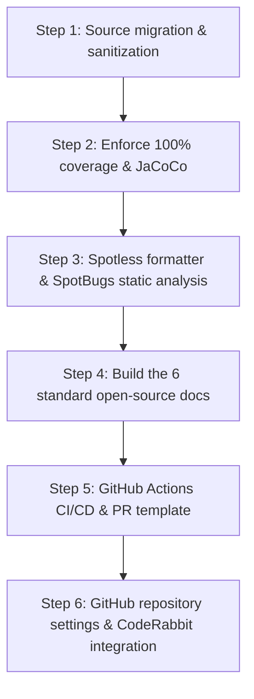

# 📘 Open Source Migration Playbook

> **Target projects**: `mybatis-sql-tuner-ai`, `mini-apm-spring-boot-starter`, `ha-excel-job-engine`, and every other open-source repository under the `sweetpark` organization.
> **Purpose**: A standard procedure for safely migrating source code out of internal/legacy repositories and standardizing it into a public open-source project with top-tier quality gates (100% coverage, Spotless, SpotBugs, CI, CodeRabbit) and standard documentation.

---

## 📋 Standard Migration Checklist (6-Step Process)



---

## 🛠 Step 1: Migrate & Sanitize the Source Code

1. **Unify package paths**:
   - Rename internal packages (e.g., `com.company.*`) to the official open-source package name:
     - Example: `io.github.sweetpark.miniapm`, `io.github.sweetpark.haexcel`
2. **Fully remove confidential and internal-only information**:
   - Search (`grep`) for and remove internal fixed IPs (e.g., `13.124.xxx.xxx`), internal-only URLs/domains, and internal test account credentials.
   - Structure configuration values so they default to `localhost` in `application.yml` and can be overridden via Spring `@ConfigurationProperties` or environment variables.
3. **Minimize the Lombok dependency / standardize on the SLF4J logger**:
   - Standardize logging on `LoggerFactory.getLogger(ClassName.class)` for compatibility across JDK 17~25+.

---

## 🧪 Step 2: Enforce Unit Tests & 100% Line Coverage

1. **Configure the JaCoCo plugin (`build.gradle`)**:
   ```groovy
   plugins {
       id 'jacoco'
   }

   jacoco {
       toolVersion = "0.8.12"
   }

   jacocoTestCoverageVerification {
       dependsOn test
       violationRules {
           rule {
               element = 'CLASS'
               limit {
                   counter = 'LINE'
                   value = 'COVEREDRATIO'
                   minimum = 1.00 // enforce 100% line coverage
               }
           }
       }
   }
   check.dependsOn jacocoTestCoverageVerification
   ```
2. **Write tests based on native Dynamic Proxy**:
   - Mock interfaces with the standard Java `Proxy.newProxyInstance(...)` to avoid bytecode-manipulation-based mocking libraries breaking on recent JDKs.

---

## 🎨 Step 3: Spotless Code Formatter & SpotBugs Static Analysis

1. **Root `build.gradle` configuration**:
   ```groovy
   plugins {
       id 'com.diffplug.spotless' version '6.25.0' apply false
       id 'com.github.spotbugs' version '6.0.26' apply false
   }

   subprojects {
       apply plugin: 'com.diffplug.spotless'
       apply plugin: 'com.github.spotbugs'

       spotless {
           java {
               eclipse()
               trimTrailingWhitespace()
               endWithNewline()
           }
       }

       spotbugs {
           toolVersion = '4.9.2'
           ignoreFailures = true
           effort = 'default'
           reportLevel = 'medium'
       }

       tasks.withType(com.github.spotbugs.snom.SpotBugsTask).configureEach {
           reports {
               html { required = true }
               xml { required = true }
           }
       }
   }
   ```
   > For a repository that wants SpotBugs to actually gate the build, set `ignoreFailures = false`
   > and add an `excludeFilter` pointing at a narrowly-scoped exclude XML for confirmed false
   > positives — see how `mybatis-sql-tuner-ai` itself is configured for a worked example.
2. **Formatting command**:
   ```bash
   ./gradlew spotlessApply
   ```

---

## 📚 Step 4: Build the 6 Standard Open Source Docs

Create the following 6 standard documents in the project root and the `docs/` folder:

| # | Document | Path | Must include |
| :---: | :--- | :--- | :--- |
| 1 | **LICENSE** | `/LICENSE` | Full Apache License 2.0 text |
| 2 | **CODE_OF_CONDUCT.md** | `/CODE_OF_CONDUCT.md` | Contributor Covenant 2.1 code of conduct |
| 3 | **CONTRIBUTING.md** | `/CONTRIBUTING.md` | Fork/branch strategy, PR process, 100% coverage build rule |
| 4 | **ARCHITECTURE.md** | `/docs/ARCHITECTURE.md` | Module/data-flow design based on Mermaid diagrams |
| 5 | **CONVENTIONS.md** | `/docs/CONVENTIONS.md` | Java coding style, Conventional Commits spec |
| 6 | **README.md** | `/README.md` | The 7 official badges, feature overview, compatibility matrix, build/run guide |

---

## 🤖 Step 5: GitHub Actions CI/CD & PR Template

1. **CI workflow (`.github/workflows/ci.yml`)**:
   - `on: [push, pull_request]`
   - Set up JDK 17 and run `./gradlew check`
   - Auto-publish a JaCoCo coverage markdown table to `$GITHUB_STEP_SUMMARY`
2. **Release workflow (`.github/workflows/release.yml`)**:
   - `on: push: tags: ['v*']`
   - Publish to Maven Central or create a GitHub Release
3. **PR template (`.github/PULL_REQUEST_TEMPLATE.md`)**:
   - Summary, changes, and a test/100%-coverage checklist

---

## ⚙️ Step 6: GitHub Repository Settings & CodeRabbit Integration

1. **Change repository visibility**:
   - Repository `Settings` → Danger Zone at the bottom → **`Make public`**
2. **Auto-delete head branches on merge**:
   - `Settings` → `General` → `Pull Requests` section → check ✅ **`Automatically delete head branches`**
3. **`main` branch protection rule**:
   - `Settings` → `Branches` → `Add branch protection rule` (Branch: `main`)
   - ✅ `Require a pull request before merging` (Require approvals: 1)
   - ✅ `Require status checks to pass before merging` (Status check: `Test & 100% Coverage Verification`)
   - ✅ `Require conversation resolution before merging`
4. **CodeRabbit AI integration**:
   - Add and install the repository at [CodeRabbit.ai](https://coderabbit.ai/)
   - Select the `Chill` review profile
